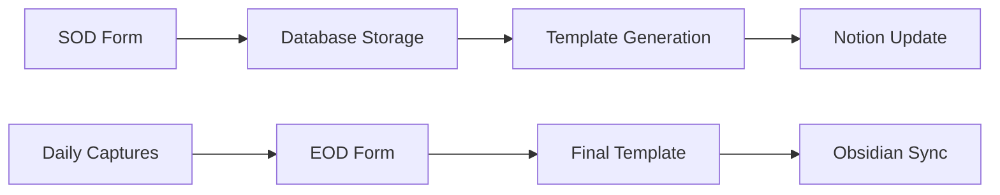

# Automation Hub

A Flask-based automation server that streamlines daily reflection workflows by processing Start-of-Day (SOD) and End-of-Day (EOD) forms, generating structured markdown templates, and integrating with Obsidian vaults and Notion workspaces.

## Features

- **Form Processing**: Automated webhook endpoints for SOD/EOD form submissions via Google Apps Script
- **Markdown Generation**: Dynamic daily note templates with Obsidian-compatible formatting and dataview queries
- **Database Integration**: PostgreSQL storage with JSON support for flexible form data handling
- **Notion Integration**: Real-time synchronization with Daily Capture pages and template updates
- **Goal Management**: Obsidian vault integration for current goal tracking and display
- **File System Sync**: Google Drive integration for seamless cross-device access
- **Previous Day Validation**: Smart checks to ensure workflow continuity and completion tracking

## Quick Start

> [!NOTE]
> This project requires Python 3.8+, PostgreSQL, and optionally ngrok for webhook testing.

1. **Install dependencies**
   ```bash
   git clone https://github.com/VictorGavo/automation-hub.git
   cd automation-hub
   pip install -r requirements.txt
   ```

2. **Setup database**
   ```bash
   # Create PostgreSQL database
   createdb automation_hub
   
   # Configure credentials in config.py or .env file
   cp .env.example .env
   # Edit .env with your database credentials
   ```

3. **Run the application**
   ```bash
   python app.py
   ```

4. **Test the integration**
   ```bash
   # Run comprehensive workflow test
   python test_full_integration.py
   ```

## Configuration

The application uses environment variables for configuration. Key settings include:

| Variable | Description | Default |
|----------|-------------|---------|
| `DB_HOST` | PostgreSQL host | `localhost` |
| `DB_USER` | Database username | `admin` |
| `DB_NAME` | Database name | `automation_hub` |
| `NOTION_ENABLED` | Enable Notion integration | `False` |
| `OBSIDIAN_GOALS_ENABLED` | Enable goal tracking | `False` |
| `GOOGLE_DRIVE_ENABLED` | Enable Drive sync | `False` |

See `config.py` for all available configuration options.

## API Reference

### Webhook Endpoints

- `POST /webhook/sod` - Process Start-of-Day form submissions
- `POST /webhook/eod` - Process End-of-Day form submissions
- `GET /health` - Application health check

### Data Endpoints

- `GET /sod/YYYY-MM-DD` - Retrieve SOD data for specific date
- `GET /eod/YYYY-MM-DD` - Retrieve EOD data for specific date

## Project Structure

```
automation-hub/
├── app.py                     # Main Flask application
├── config.py                  # Configuration management
├── database.py                # PostgreSQL database operations
├── markdown_generator.py      # Template generation engine
├── notion_manager.py          # Notion API integration
├── obsidian_goal_manager.py   # Goal tracking and vault integration
├── file_system.py             # Google Drive file operations
├── test_*.py                  # Comprehensive test suite
├── daily_notes/               # Generated markdown templates
└── cache/                     # Goal cache and temporary files
```

## Integration Workflow

The system follows a structured daily workflow:

1. **Morning Setup**: SOD form triggers template generation and Notion updates
2. **Daily Capture**: Mobile thoughts and notes collected via Notion
3. **Evening Reflection**: EOD form processes captures and completes templates
4. **File Sync**: Generated markdown files sync to Obsidian vault via Google Drive



## Testing

The project includes comprehensive testing utilities:

```bash
# Test complete workflow
python test_full_integration.py

# Test individual components
python test_core_functionality.py
python test_notion.py
python test_obsidian_goals.py

# Run all tests
python run_tests.py
```

> [!TIP]
> Tests use yesterday's date by default to avoid overwriting current daily data.

## Mobile Capture Strategy

### Current Architecture
Mobile thoughts → Notion API → Daily Capture Page → EOD Processing → Obsidian Import

### Performance Considerations
The system currently experiences mobile performance bottlenecks due to Notion app loading times. A future migration to a custom widget approach is planned to eliminate these friction points while maintaining all processing logic.

## Development

### Branching Strategy

This project uses a dual-branch development approach:

#### **`ai-assisted` Branch** 
- **Purpose**: AI-driven development and rapid prototyping
- **Use Case**: Quick fixes, feature implementation, and comprehensive solutions
- **Workflow**: GitHub Copilot provides most code implementations
- **Target**: Fast iteration and learning from AI-generated solutions

#### **`self-driven` Branch**
- **Purpose**: Manual development and deep learning
- **Use Case**: Personal skill building and understanding implementation details  
- **Workflow**: You write the code yourself with minimal AI assistance
- **Target**: Mastery of concepts and independent problem-solving

#### **`main` Branch**
- **Purpose**: Stable production code
- **Workflow**: Merge tested features from either development branch
- **Protection**: Only merge fully tested and documented code

### Environment Setup

```bash
# Setup virtual environment
python -m venv automation-env
source automation-env/bin/activate  # Linux/Mac
# or automation-env\Scripts\activate  # Windows

# Install development dependencies
pip install -r requirements.txt

# Choose your development approach
git checkout ai-assisted    # For AI-assisted development
# OR
git checkout self-driven    # For self-driven development
```

### Adding New Features

**For AI-Assisted Branch:**
1. Create feature branch from `ai-assisted`
2. Use GitHub Copilot for rapid implementation
3. Add comprehensive tests with AI assistance
4. Document API changes and merge back to `ai-assisted`
5. When stable, merge to `main`

**For Self-Driven Branch:**
1. Create feature branch from `self-driven`  
2. Write code manually with minimal AI assistance
3. Research and implement solutions independently
4. Add tests and documentation yourself
5. When stable, merge to `main`

## Deployment

The application is designed for Raspberry Pi deployment with Docker support. Key deployment considerations:

- PostgreSQL database setup
- Google Drive authentication (service account or OAuth)
- Notion API token configuration
- Webhook URL configuration in Google Apps Script

For production deployment, consider using environment variables for all sensitive configuration and setting up proper logging and monitoring.